# AI Colleagues Platform — Architecture Diagrams

> Generated from the **actual deployed code** (Prisma schema + RBAC map + API routes), not the original plan.
> Source of truth: `prisma/schema.prisma`, `src/lib/rbac/index.ts`, `src/app/api/**`.

---

## 1. Actors & Roles

There are **two independent role systems** that combine per user:

| Role | Type | How it's granted | Key capabilities |
|---|---|---|---|
| **Anonymous Visitor** | external | none (public) | chat with a *published + deployed + public* agent; request human handover |
| **Employee** | HRMS-derived | any User linked to an `Employee` (JIT email match on login) | chat with Employee VA, view profile/leave, apply/cancel leave, escalate to case |
| **Manager** | HRMS-derived | `Employee.reports.length > 0` (has direct reports) | everything an Employee can + decide approvals for their reports |
| **support_agent** | platform (RoleBinding) | assigned by owner/admin via `/api/roles` | `inbox.view`, `inbox.reply` |
| **analyst** | platform (RoleBinding) | assigned by owner/admin | `analytics.view` |
| **domain_admin** | platform (RoleBinding) | assigned by owner/admin (can be agent-scoped) | configure/publish/deploy agents, knowledge, skills, inbox, analytics |
| **admin** | platform (RoleBinding) | assigned by owner | all of domain_admin + users.manage, roles, audit, directory, integrations, hrms.sync |
| **owner** | platform (RoleBinding) | auto-granted to the workspace creator at signup | `*` (everything) |

**Key idea:** *Platform roles* (RoleBinding) govern the builder/governance surface (`can()`).
*HRMS roles* (employee/manager) govern the delegated employee surface (`canAsUser()` — the AI acts as the user). A person can be both (e.g., the owner who is also an employee with reports).

---

## How to read this document

Every diagram below is followed by a three-part panel:
- **Read this to understand** — the one-line purpose of the diagram.
- **Elements** — what each box/actor/class is and what it connects to.
- **User stories that create these connections** — the requirement(s) whose flow produces those edges, using the locked IDs from `docs/planning/PLANNING.md §3`.

**Story status legend:** ✅ built & deployed · 🟡 partial / lite / mock · ⛔ later.
**Story ID prefixes:** `EMP-` Employee · `MGR-` Manager · `DA-` Domain Admin · `WA-` Workspace Admin/Owner · `SA-` Support Agent · `AN-` Analyst · `EV-` External Visitor.

---

## 2. Use Case Diagrams

### 2a. Anonymous Visitor & Employee (the consumption surface)

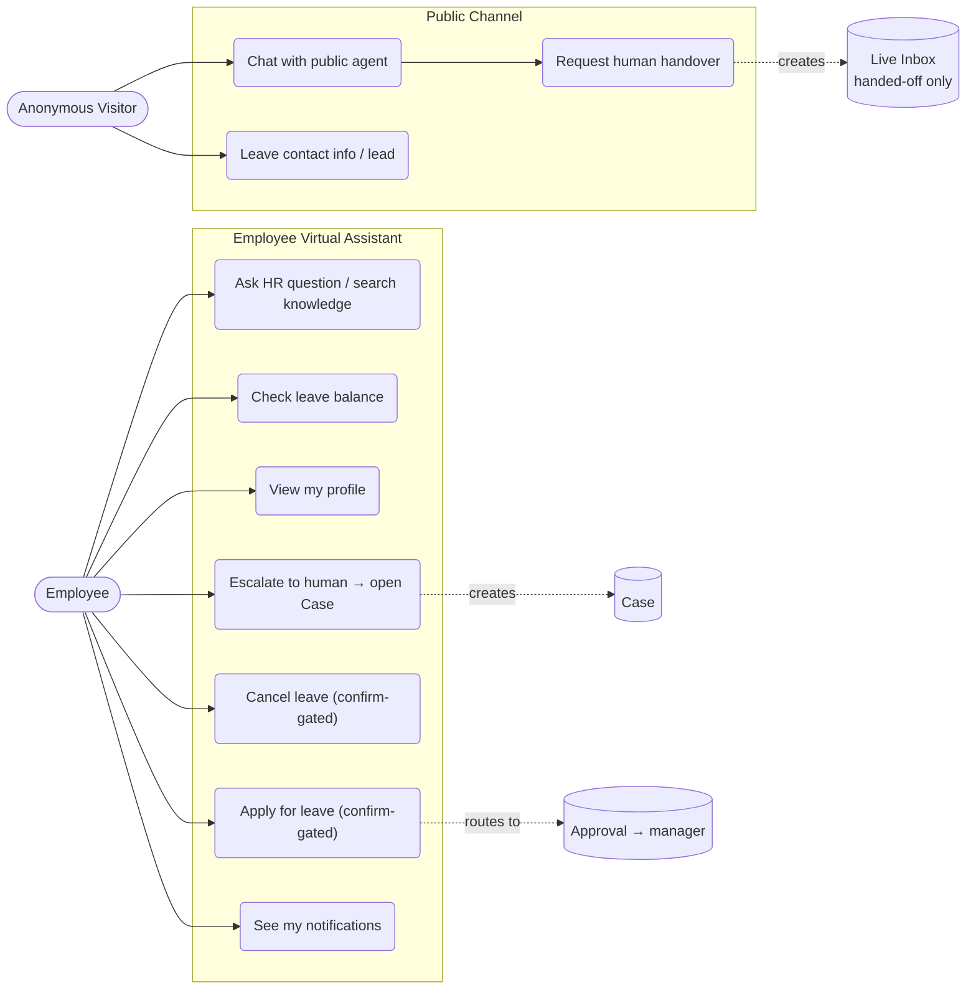

**Read this to understand:** what an end user (anonymous website visitor, or a signed-in employee) can actually *do* — the consumption surface where conversations and the action spine begin.

**Elements**

| Element | What it is | Connects to |
|---|---|---|
| Anonymous Visitor | unauthenticated user on a public, deployed agent | Public Channel only; never reaches internal data |
| Employee | a `User` linked to an `Employee` (JIT email match) | Employee Virtual Assistant (`/assistant`) |
| Public Channel | `/chat/[agentId]` → persists a `Conversation` | Live Inbox (only after handover) |
| Employee VA | `/api/assistant/chat` → skill registry; **not persisted = private** | read skills, Confirmation, Case |
| Live Inbox / Case / Approval | downstream artifacts created by escalation/actions | Manager / Support Agent surfaces |

**User stories that create these connections**

| Story | As a… I want… | Connection it creates | Endpoint / entities |
|---|---|---|---|
| EV-1 ✅ | visitor: chat with a public colleague without signing in | Visitor → public agent | `/chat/[id]` → `Conversation` |
| EV-2 ✅ | visitor: answers from public KB only | public agent → knowledge (filtered) | `searchKnowledge` |
| EV-3 ✅ | visitor: leave name/email | Visitor → Lead | `Lead` |
| EV-4 🟡 | visitor: escalate to a human | public chat → Live Inbox | `Conversation.handedOff` |
| EV-5 ✅ | visitor: be blocked from anything internal | (negative) no edge to internal data | guardrails |
| EMP-1 ✅ | employee: sign in and land in my assistant | Employee → Employee VA | JIT link, `/assistant` |
| EMP-3,4,5,6,17 ✅/🟡 | cited answers, follow-ups, no fabrication, right colleague | Employee VA → knowledge | `searchKnowledge` (role-filtered) |
| EMP-8 ✅ | check my leave balance | Employee VA → read skill | `get_leave_balance` |
| EMP-7 ✅ | view my profile | Employee VA → read skill | `get_profile` |
| EMP-9, EMP-12 ✅ | apply leave from chat, confirm first | Employee VA → Confirmation → Approval | `apply_leave` → `Confirmation` → `ApprovalRequest` |
| EMP-10, EMP-12 ✅ | cancel my pending leave | Employee VA → Confirmation | `cancel_leave` |
| EMP-13,14,15 🟡 | escalate / raise a case | Employee VA → Case | `create_case` → `Case` |
| EMP-16 🟡 | be notified of decisions | Employee → Notification | `Notification` |

---

### 2b. Manager (the approvals surface)

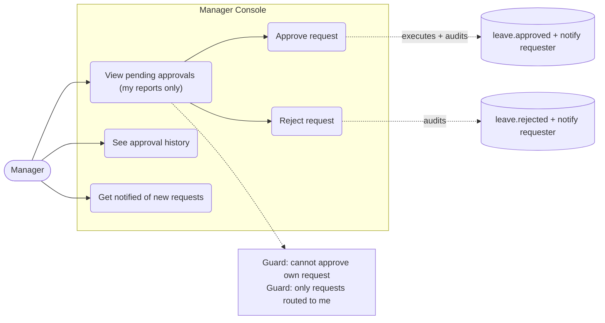

**Read this to understand:** the *other half* of the leave flow — how a manager sees and decides requests that employees submitted, and the guards that keep it scoped and safe.

**Elements**

| Element | What it is | Connects to |
|---|---|---|
| Manager | an `Employee` with `reports.length > 0` (HRMS-derived) | Manager Console (`/approvals`) |
| Manager Console | `/approvals` UI + `GET/POST /api/approvals` | `ApprovalRequest`, `Notification`, `AuditLog` |
| Decision execution | `decideApproval()` flips status, audits, notifies | `ApprovalRequest`, `AuditLog`, `Notification` |
| Guards | self-approval block + approver-scope check | enforced in `decideApproval` + route |

**User stories that create these connections**

| Story | As a Manager I want… | Connection it creates | Endpoint / entities |
|---|---|---|---|
| MGR-4 ✅ | see pending approvals waiting on me | Manager → pending `ApprovalRequest` | `GET /api/approvals` (status=pending) |
| MGR-5 ✅ | approve/reject a report's leave after confirm | Manager → decision → execute+audit+notify | `POST /api/approvals` → `decideApproval` |
| MGR-7 ✅ | see full context before deciding | approval payload → decision card | `ApprovalRequest.payload` |
| MGR-8 ✅ | approvals gated to my direct reports only | scope guard (wrong-manager denied+logged) | `approverEmployeeId` filter + `auditDeny` |
| MGR-9 ✅ | be notified when a report submits | submit → `Notification` to approver | `approval_pending` notification |
| MGR-11 ✅ | manager-only options shown only to managers | `isManager` gate on nav | `/api/auth/me.isManager` |
| MGR-1, MGR-2 ✅ | view team roster / report's leave | Manager → Directory (reports) | `/api/directory`, `Employee.reports` |

---

### 2c. Support Agent & Analyst (operations surface)

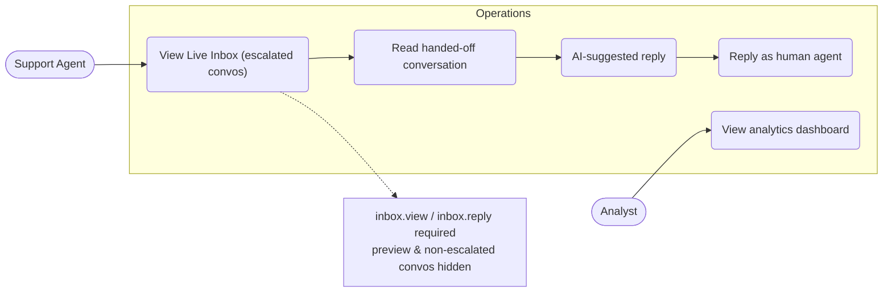

**Read this to understand:** the two *composable* operational capabilities — handling escalated conversations (Support Agent) and reading aggregate metrics (Analyst). Both are platform roles assigned via `RoleBinding`, not HRMS-derived.

**Elements**

| Element | What it is | Connects to |
|---|---|---|
| Support Agent | holder of `inbox.view` + `inbox.reply` | Live Inbox (`/inbox`) |
| Analyst | holder of `analytics.view` | Analytics dashboard (`/analytics`) |
| Live Inbox | `/api/conversations` — only `handedOff=true`, `channel≠preview` | `Conversation`, `Message` |
| AI-suggested reply | `/api/conversations/[id]/suggest` (copilot draft) | `searchKnowledge`, LLM |
| Analytics | `/api/analytics` (aggregate counts, preview excluded) | `Conversation`, `Message`, `Lead` |

**User stories that create these connections**

| Story | As a… I want… | Connection it creates | Endpoint / entities |
|---|---|---|---|
| SA-1 ✅ | see handed-off conversations needing a human | Agent → escalated `Conversation` | `GET /api/conversations` |
| SA-3 ✅ | read full AI context then reply as human | Agent → `Message` (role=agent) | `/messages`, `/suggest` |
| SA-5 ✅ | change status (open→resolved) | Agent → conversation status | `Conversation.status` |
| SA-2, SA-4 🟡 | claim a conversation / internal notes | (later) ownership + notes | — |
| SA-6 ✅ | only access my workspace's conversations | tenant scope on every read | `agent.orgId` filter |
| AN-1, AN-2 🟡 | usage + resolution/escalation metrics | Analyst → analytics | `/api/analytics` |
| AN-4 ✅ | read-only, no config/actions | (negative) analytics only | `analytics.view` only |

---

### 2d. Admin & Owner (builder + governance surface)

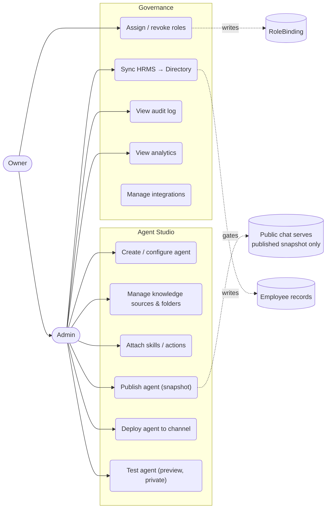

---

**Read this to understand:** how colleagues (agents) are built, published, and deployed, and how the workspace is governed (HRMS sync, roles, audit). This is the source of everything the other surfaces consume.

**Elements**

| Element | What it is | Connects to |
|---|---|---|
| Agent Studio | `/agents` builder → `Agent` + draft config | `KnowledgeSource`, `AgentAction`, publish/deploy |
| Publish | snapshots draft into `Agent.publishedConfig` | what public chat serves |
| Deploy | flips `Agent.deployed` (+ `Deployment` per channel) | public chat availability |
| Preview test | `/api/agents/[id]/chat` tagged `channel=preview` | private; excluded from inbox/analytics |
| HRMS sync | `/api/hrms/sync` via `HrmsConnection` provider | creates `Employee` records + manager edges |
| Roles | `/api/roles` assign/revoke | `RoleBinding` |
| Audit | `/api/audit` | `AuditLog` |

**User stories that create these connections**

| Story | As a… I want… | Connection it creates | Endpoint / entities |
|---|---|---|---|
| DA-1, DA-2 ✅ | create/configure a colleague | Admin → `Agent` | `/api/agents` |
| DA-3 ✅ | set Access mode (internal/public) | Agent → access policy | `Agent.accessMode` |
| DA-4 ✅ | publish (snapshot) | Agent → `publishedConfig` | `/api/agents/[id]/publish` |
| DA-5 ✅ | deploy to channels | Agent → deployed + `Deployment` | `/api/agents/[id]/deploy` |
| DA-6 ✅ | test in live preview | Admin → preview `Conversation` | `channel=preview` |
| DA-7, DA-9 ✅ | attach/test knowledge | Agent → `KnowledgeSource` | `/api/agents/[id]/knowledge` |
| DA-8 ✅ | role/audience access on folders | Agent → `KnowledgeFolder.allowedRoles` | filter-then-prompt |
| DA-10, DA-11 ✅ | add skills, mark confirm-required | Agent → `AgentAction` | `/api/agents/[id]/actions` |
| DA-13 ✅ | set guardrails | Agent → `guardrails` | `Agent.guardrails` |
| DA-14 ✅ | be scoped to my colleague only | colleague-scoped `RoleBinding` | `can(user, cap, agentId)` |
| WA-1 ✅ | set up our workspace | Owner → `Organization` | signup |
| WA-3, WA-4 ✅ | connect+sync HRMS, see directory | Org → `Employee` records | `/api/hrms/sync`, `/api/directory` |
| WA-5 ✅ | assign platform roles | Owner → `RoleBinding` | `POST /api/roles` |
| WA-6 ✅ | view audit log of sensitive actions | Owner → `AuditLog` | `GET /api/audit` |
| WA-9, DA-12 🟡 | manage integration providers | Org → `HrmsConnection` | provider interface |
| WA-12 🟡 | (Owner) transfer/delete workspace | Owner-only destructive | — (later) |

---

## 3. Class Diagrams (data model)

### 3a. High-level context — the four subsystems

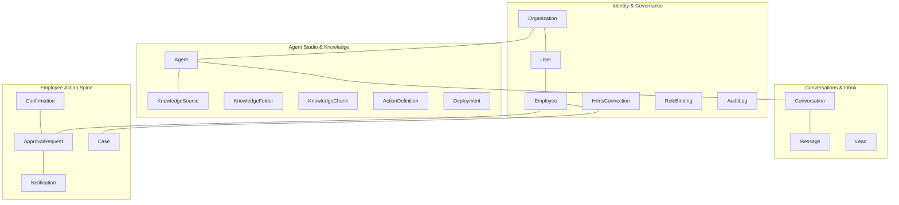

**Read this to understand:** the 30,000-ft view — how the four subsystems relate. Everything hangs off `Organization` (the tenant); `User`↔`Employee` is the bridge between the platform side and the HR side.

**The four subsystems**

| Subsystem | Core classes | Responsibility | Primary stories |
|---|---|---|---|
| Identity & Governance | Organization, User, Employee, HrmsConnection, RoleBinding, AuditLog | who exists, who can do what, what happened | WA-1,3,4,5,6 · EMP-1 |
| Agent Studio & Knowledge | Agent, KnowledgeSource, KnowledgeFolder, KnowledgeChunk, ActionDefinition, Deployment | build/configure/publish/deploy colleagues + their grounding | DA-1..14 |
| Conversations & Inbox | Conversation, Message, Lead | runtime chats (public + preview) + human handoff | EV-1..4 · SA-1,3 |
| Employee Action Spine | Confirmation, ApprovalRequest, Notification, Case | the permission→confirm→execute→audit→notify workflow | EMP-9..16 · MGR-4,5,9 |

---

### 3b. Identity, Org & Governance

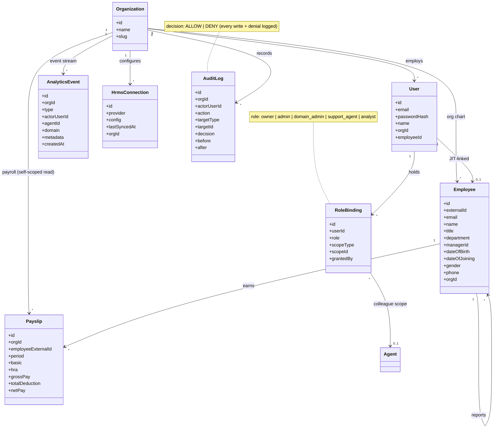

**Read this to understand:** the dual identity model. A `User` is a login; an `Employee` is an HR-org record. They link 1:1 by email (JIT at login). Authorization comes from two places: `RoleBinding` (platform) and `Employee.reports` (manager). Every sensitive action writes `AuditLog`.

**Classes**

| Class | What it is | Key connections | Stories |
|---|---|---|---|
| Organization | the tenant; everything is scoped to it | owns Users, Employees, Agents, Leads, AuditLogs | WA-1 |
| User | a login account | belongs to Org; 0..1 Employee; holds RoleBindings | EMP-1, WA-1 |
| Employee | an HRMS person record | self-relation manager↔reports; 0..1 User | WA-3, WA-4, MGR-1 |
| HrmsConnection | per-org HRMS provider config | drives `syncEmployees` (mock→OrangeHRM) | WA-3, WA-9 |
| RoleBinding | a platform role grant (optionally agent-scoped) | User→role; scopeId→Agent | WA-5, DA-14 |
| AuditLog | append-only record of writes + denials | Org→logs; ALLOW/DENY | WA-6, MGR-8, EV-5 |

**Connections (edges) and the stories behind them**

| Edge | Meaning | Story |
|---|---|---|
| User → Employee (JIT-linked) | login mapped to HR identity on first sign-in | EMP-1, WA-3 |
| Employee → manager / reports | the org chart that powers manager scope | MGR-1, MGR-8 |
| User → RoleBinding | platform permissions (owner/admin/…) | WA-5 |
| RoleBinding → Agent (colleague scope) | a Domain Admin scoped to one colleague | DA-14 |
| Org → AuditLog | governance trail for every write/denial | WA-6 |

---

### 3c. Agent Studio & Knowledge

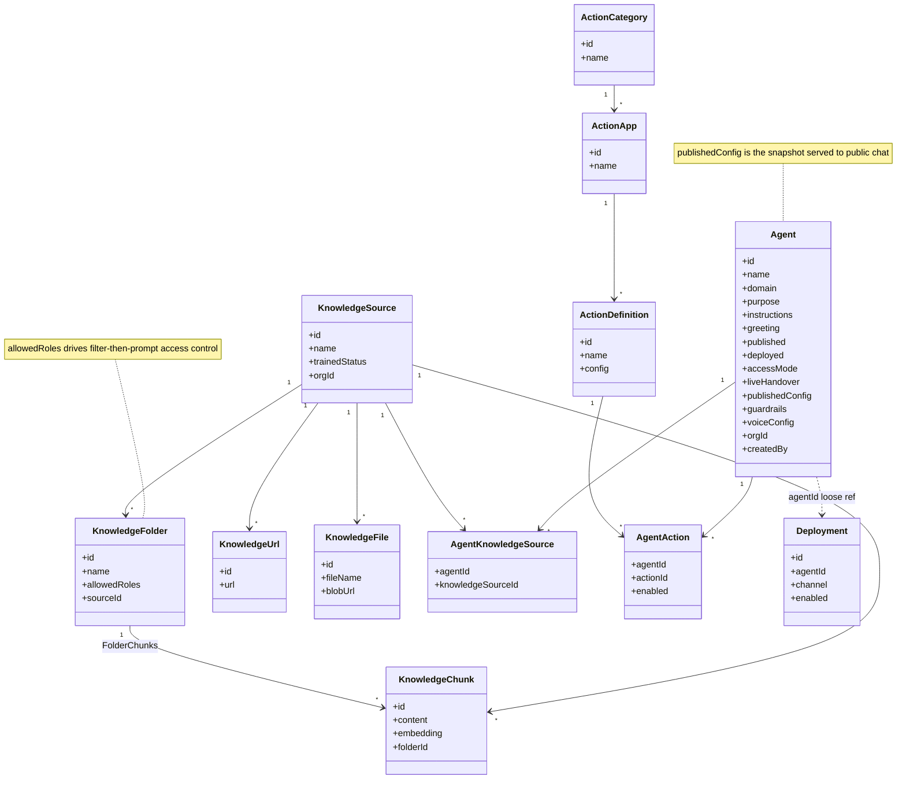

**Read this to understand:** how a colleague is assembled. An `Agent` points at knowledge (many-to-many via a join) and skills (many-to-many via a join). Knowledge is chunked + embedded for retrieval, and folders carry the access rules.

**Classes**

| Class | What it is | Key connections | Stories |
|---|---|---|---|
| Agent | a configurable AI colleague | M:N KnowledgeSource & ActionDefinition; has Conversations | DA-1,2,3,4,5 |
| KnowledgeSource | a container of knowledge for an org | has Urls, Files, Chunks, Folders | DA-7 |
| KnowledgeFolder | grouping with `allowedRoles[]` | gates which chunks a user may retrieve | DA-8, EMP-6 |
| KnowledgeChunk | embedded text slice (`vector(1536)`) | belongs to source; optional folder | EMP-3 (citations) |
| AgentKnowledgeSource | join table (Agent ↔ KnowledgeSource) | the M:N link | DA-7 |
| ActionCategory/App/Definition | the skills catalog hierarchy | Definition → AgentAction | DA-10 |
| AgentAction | a skill attached to an agent (enabled flag) | Agent ↔ ActionDefinition | DA-10, DA-11 |
| Deployment | per-channel deploy record (loose ref) | web/voice/slack/teams | DA-5, DA-VOICE |

**Connections and stories**

| Edge | Meaning | Story |
|---|---|---|
| Agent ↔ KnowledgeSource (via join) | which knowledge a colleague can use | DA-7 |
| KnowledgeFolder → Chunk + allowedRoles | filter-then-prompt access control | DA-8 |
| Agent ↔ ActionDefinition (via AgentAction) | which skills/tools a colleague can call | DA-10, DA-11 |
| Agent → Deployment | multi-channel availability (web now; voice later) | DA-5 |

---

### 3d. Conversations & Inbox

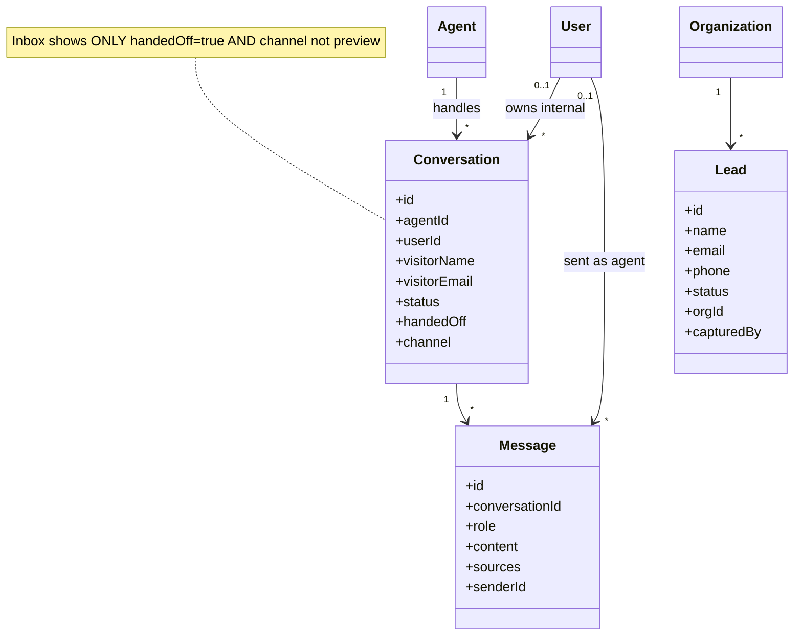

**Read this to understand:** runtime chats and the privacy gate. Only *public* and *preview* chats persist as `Conversation`; the employee VA does not. The inbox only ever exposes escalated (`handedOff`), non-preview conversations.

**Classes**

| Class | What it is | Key connections | Stories |
|---|---|---|---|
| Conversation | a chat thread (public visitor or builder preview) | belongs to Agent; has Messages; `handedOff`, `channel` | EV-1, SA-1, DA-6 |
| Message | one turn (user / assistant / agent) | belongs to Conversation; optional human sender | EMP-4, SA-3 |
| Lead | captured contact from public chat | belongs to Org | EV-3 |

**Connections and stories**

| Edge | Meaning | Story |
|---|---|---|
| Agent → Conversation | the agent that handled the chat | EV-1 |
| Conversation → Message | the turns of the thread | EMP-4 |
| Conversation.handedOff (the inbox gate) | only escalated convos reach a human | EV-4, SA-1 |
| channel=preview (excluded) | builder test chats stay out of inbox/analytics | DA-6 |
| User → Message (sender) | a human agent's reply | SA-3 |
| Org → Lead | visitor contact capture | EV-3 |

> **Privacy note (from the last fix):** the Employee VA (`/api/assistant/chat`) has **no edge into `Conversation`** — employee↔bot HR chats are never persisted, so they can't appear in the inbox.

---

### 3e. Employee Action Spine (the permission → confirm → execute → audit → notify flow)

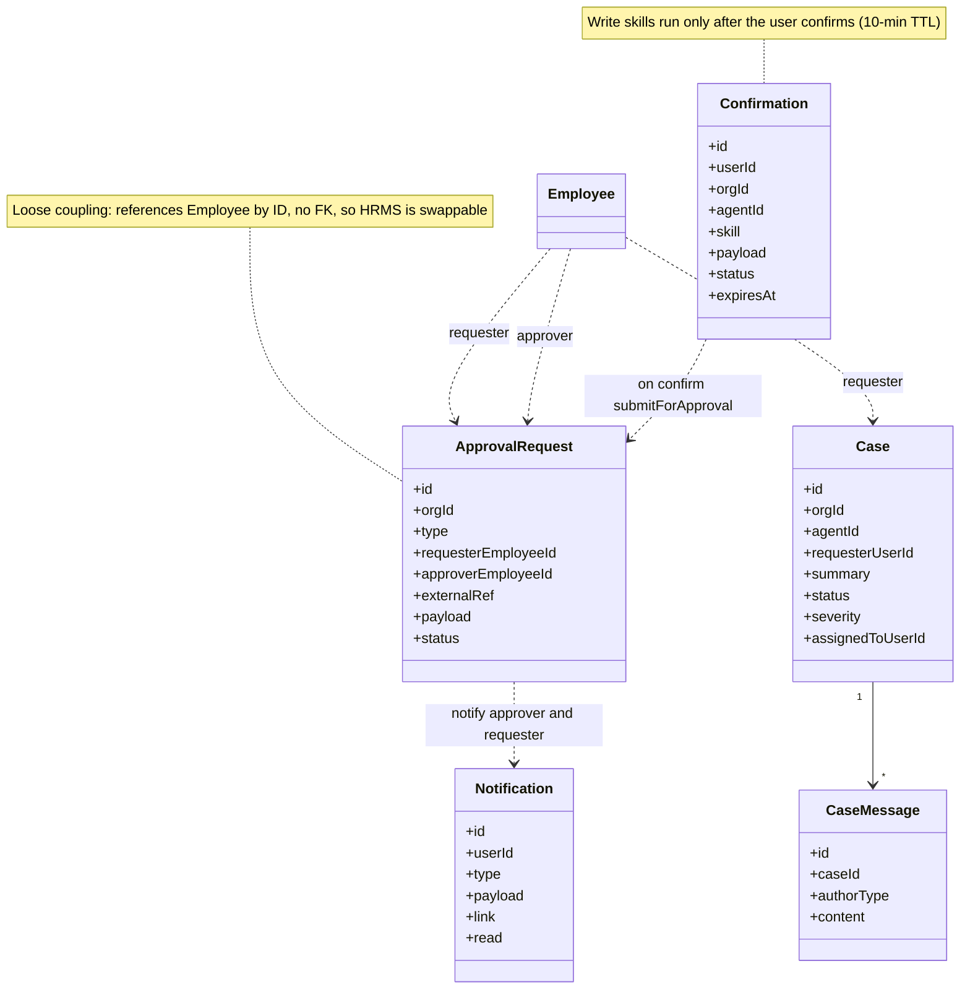

---

**Read this to understand:** the heart of the product — how a write action goes from intent to executed, safely. These four classes implement the action spine and are deliberately ID-linked (no FKs) so the HRMS can be swapped.

**Classes**

| Class | What it is | Key connections | Stories |
|---|---|---|---|
| Confirmation | a pending write awaiting user consent (10-min TTL) | created by write skills; on confirm → execute | EMP-12, DA-11 |
| ApprovalRequest | a request routed to a manager | requester+approver Employee (by ID); `externalRef` to leave | EMP-9, MGR-5 |
| Notification | in-app message to a user | approval_pending / approval_decided / case_update | EMP-16, MGR-9 |
| Case | an escalation ticket | has CaseMessages; requester/assignee by ID | EMP-13, EMP-15 |
| CaseMessage | a turn in a case thread | belongs to Case | EMP-15 |

**The spine, step by step (and the stories at each step)**

| Step | What happens | Entities | Story |
|---|---|---|---|
| 1. Permission | `canAsUser` checks employee/manager capability | — | cross-cutting |
| 2. Confirm | write skill creates a `Confirmation`; user must confirm | Confirmation | EMP-12 |
| 3. Execute | on confirm, `applyLeave` runs → routes to manager | ApprovalRequest | EMP-9 |
| 4. Audit | every write + denial logged | AuditLog | WA-6 |
| 5. Notify | approver notified; on decision, requester notified | Notification | MGR-9, EMP-16 |
| Decision | manager approves/rejects → executes + audits + notifies | ApprovalRequest, AuditLog, Notification | MGR-5 |
| Escalation | unresolved → `Case` opened with an ID | Case, CaseMessage | EMP-13 |

> **Why loose coupling:** `ApprovalRequest`/`Case` store `requesterEmployeeId` as a plain string (no FK). This is intentional — when the real OrangeHRM provider replaces the mock, employee identity can change shape without breaking these tables.

---

## 4. "What's connected to what" — the wiring map

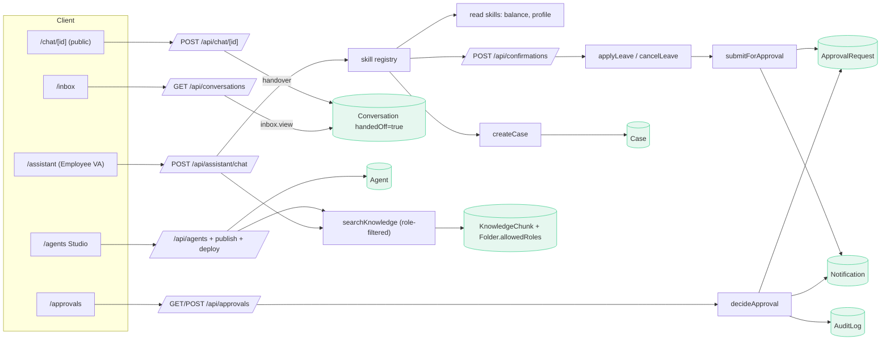

**Read this to understand:** the runtime call paths — UI → API → skill/service → data store — and how the same data stores are shared across surfaces. Use this when tracing "where does this request go?".

**End-to-end story traces through the wiring**

| Flow | Path | Stories |
|---|---|---|
| Apply leave end-to-end | `/assistant` → `/api/assistant/chat` → registry → `/api/confirmations` → `applyLeave` → `submitForApproval` → `ApprovalRequest` + `Notification` | EMP-9, EMP-12, MGR-9 |
| Manager decides | `/approvals` → `/api/approvals` → `decideApproval` → `ApprovalRequest` + `AuditLog` + `Notification` | MGR-5, EMP-16 |
| Escalate to case | `/assistant` → `create_case` → `Case` | EMP-13 |
| Public chat + handover | `/chat/[id]` → `/api/chat/[id]` → `Conversation(handedOff=true)` → `/inbox` | EV-1, EV-4, SA-1 |
| Grounded answer | `/assistant` or `/api/agents/[id]/chat` → `searchKnowledge` → `KnowledgeChunk` (role-filtered) | EMP-3, DA-8 |
| Build & publish | `/agents` → `/api/agents` + publish + deploy → `Agent.publishedConfig` | DA-1, DA-4, DA-5 |

---

### Cross-cutting reusable seams (applied on every write)
1. **`can()` / `requireCan()`** — platform RBAC gate (builder/governance writes).
2. **`canAsUser()`** — delegated employee/manager gate (the AI acts as the user).
3. **`audit()` / `auditDeny()`** — every write and every denial is logged to `AuditLog`.
4. **Confirmation gate** — write skills create a `Confirmation` and only execute on explicit user confirm.
5. **Filter-then-prompt** — `searchKnowledge` excludes `KnowledgeFolder.allowedRoles` the user lacks.
6. **Published-snapshot enforcement** — public chat serves `Agent.publishedConfig`, never the live draft.
7. **Provider interface** — `HrmsProvider` (mock today, OrangeHRM adapter) swappable by config.

---

## 5. Sequence Diagrams (timing & order)

> Class and use-case diagrams show *structure*; these show *order over time* — exactly when each call happens and where the guards sit.

### 5a. Apply leave → manager approves (the full action spine)

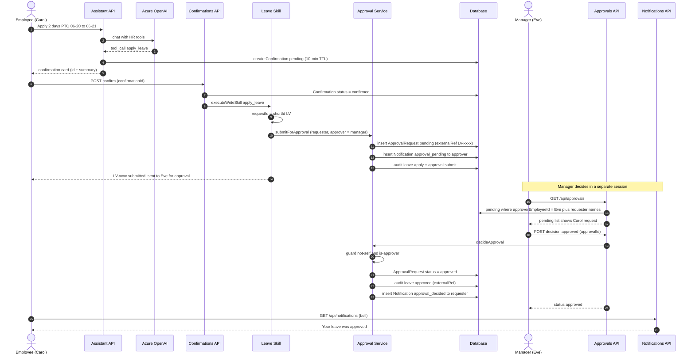

**Read this to understand:** the exact order of the *permission → confirm → execute → audit → notify* spine, and that the write (`submitForApproval`) only happens **after** the user confirms (steps 6–10). The manager half (steps 16–24) runs in a different session/browser.

**The two critical guards (and when they fire)**
| Step | Guard | Story |
|---|---|---|
| 4–6 | Write is **not executed** until a `Confirmation` is created and the user confirms | EMP-12 |
| 21 | `decideApproval` rejects **self-approval** and **non-approver** before mutating | MGR-8 |
| 13, 22 | Both sides are notified (approver on submit, requester on decision) | MGR-9, EMP-16 |

**Stories realized:** EMP-9 (apply from chat), EMP-12 (confirm-first), MGR-4 (see pending), MGR-5 (decide), MGR-9 (notify approver), EMP-16 (notify requester).

### 5b. Public chat → live human handover

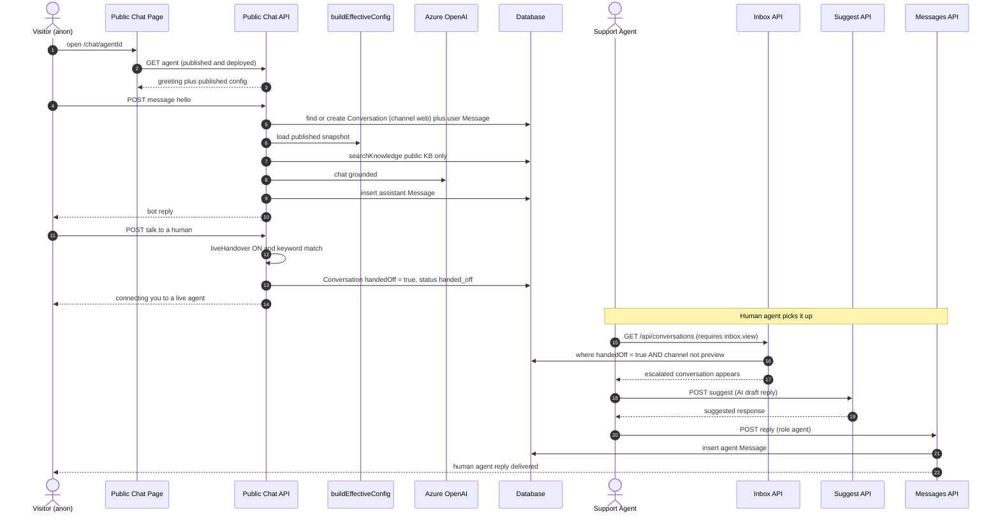

**Read this to understand:** why a conversation is invisible to humans **until** the visitor escalates. The bot handles steps 4–10 privately; only step 13 sets `handedOff=true`, and only then (step 15–16) does it appear in the agent's inbox — gated by `inbox.view`.

**The privacy gates (and when they fire)**
| Step | Gate | Story |
|---|---|---|
| 2 | Public chat serves the **published snapshot**, never the live draft | DA-4 |
| 7 | Retrieval is **public KB only** (filter-then-prompt) | EV-2, DA-8 |
| 13 | Conversation enters the inbox **only on handover** | EV-4 |
| 15 | Inbox read requires `inbox.view`; `channel=preview` excluded | SA-1, SA-6 |

**Stories realized:** EV-1 (public chat), EV-2 (public KB only), EV-4 (escalate), SA-1 (queue), SA-3 (read context + reply), DA-4 (published snapshot).

---

## 6. Notable design decisions (visible in the diagrams)

- **Two-axis authorization.** Platform roles (RoleBinding) and HRMS roles (employee/manager) are orthogonal and combine per user.
- **Loose coupling of the action spine.** `Confirmation`, `ApprovalRequest`, `Notification`, `Case` reference users/employees **by ID (no FK relations)**. This is deliberate: it lets the HRMS provider be swapped and avoids hard FK coupling to the org chart.
- **Privacy by escalation.** Employee↔bot chats (`/api/assistant/chat`) are **not persisted**. Only escalated public conversations (`handedOff=true`, `channel!=preview`) ever enter the Live Inbox, gated by `inbox.view`.
- **Preview isolation.** Builder test chats are tagged `channel=preview` and excluded from inbox + analytics.

---

## 7. Where to look (role → diagram coverage)

| If you are / care about… | Read these diagrams | Stories covered |
|---|---|---|
| Employee experience | 2a, 3d, 3e | EMP-1..18 |
| Manager / approvals | 2b, 3e | MGR-1..12 |
| Support / inbox | 2c, 3d | SA-1..6 |
| Analyst / metrics | 2c, 3d | AN-1..5 |
| Builder (Domain Admin) | 2d, 3c | DA-1..16 |
| Owner / governance | 2d, 3b | WA-1..12 |
| Public visitor | 2a, 3d | EV-1..5 |
| Data model overview | 3a → 3b/3c/3d/3e | all |
| Runtime call paths | 4 | end-to-end traces |

**Coverage note:** 74 stories across 7 roles (`PLANNING.md §3`). ✅ items are built & deployed; 🟡 are partial/mock (notably voice, claim/notes in inbox, reminders, billing). Every diagram edge above traces to at least one story; every ✅ story traces to at least one diagram.

---

## 4. HRMS Agentic Deepening (Frappe = source of truth)

> Added in the agentic-deepening sprint. **Principle:** every read pulls from Frappe HR; every
> action **writes back to Frappe** (confirm-gated → passport-gated → audited → analytics event).
> Provider methods live behind the `HrmsProvider` interface so the Zoho swap stays config-only.

### 4a. Skill registry (current)

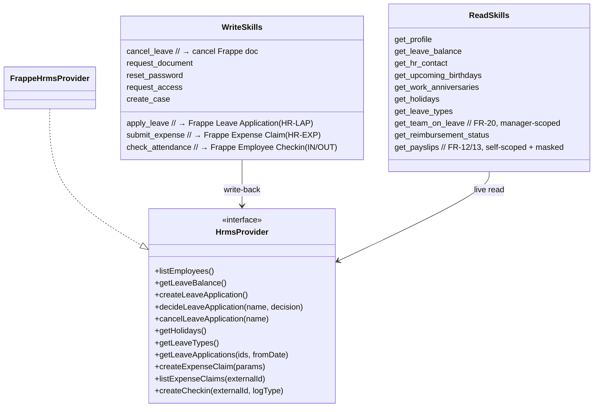

### 4b. Leave approval round-trip (real write-back)

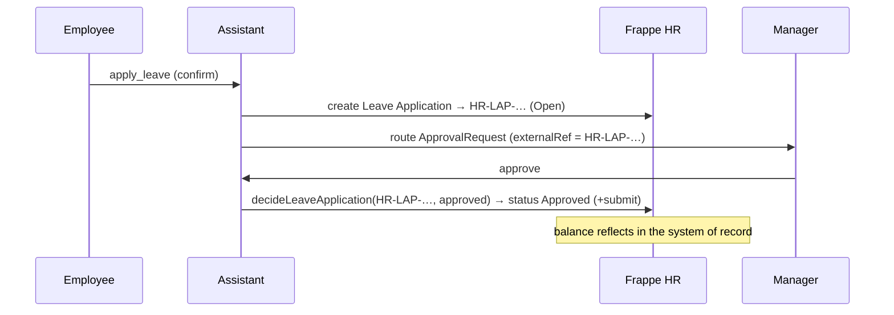

### 4c. BRD coverage delta
- **FR-03** (what-if) · **FR-04** (company-policy vs general labeling + citation) — in the assistant prompt.
- **FR-20** (team leave calendar) — `get_team_on_leave`, manager-scoped.
- **FR-12 / FR-13** (payslips + explain) — `get_payslips`, strictly self-scoped (NFR-02/05), audited (NFR-04).
- **FR-41** (actions with confirmation + transaction ID) — real Frappe IDs (HR-LAP / HR-EXP / EMP-CKIN).
- **BRD Phase 5** (proactive intelligence) — birthdays / anniversaries / holidays Celebrations widget.

### 4d. Honest limitation
Payroll **Salary Slips** are MVP-seeded in our Postgres (`Payslip`) because the Frappe trial's payroll
auto-calc is blocked by a holiday-list validation quirk. The read path can target Frappe `Salary Slip`
in production via a provider method. Appraisal / Training / Onboarding modules exist in Frappe but have
no data yet — same seed-then-read pattern would apply (fast-follow).
