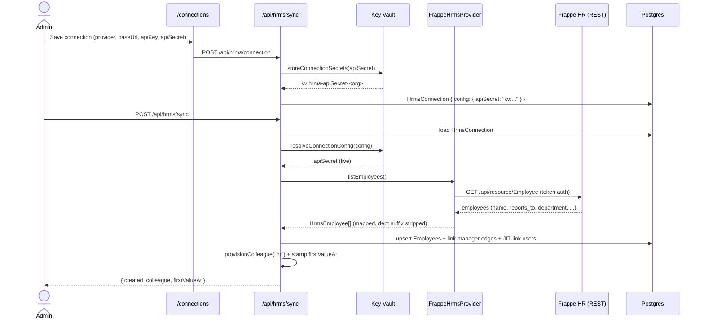
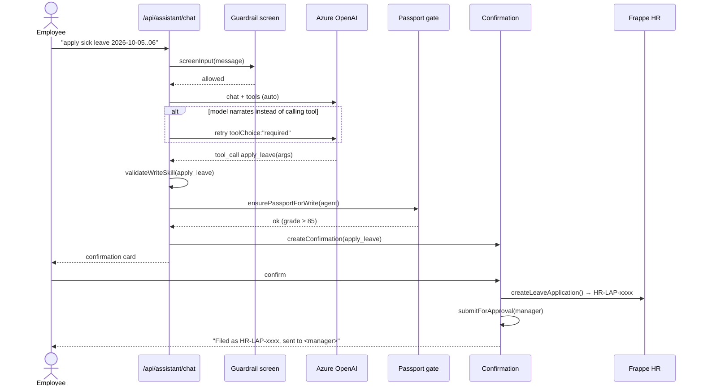
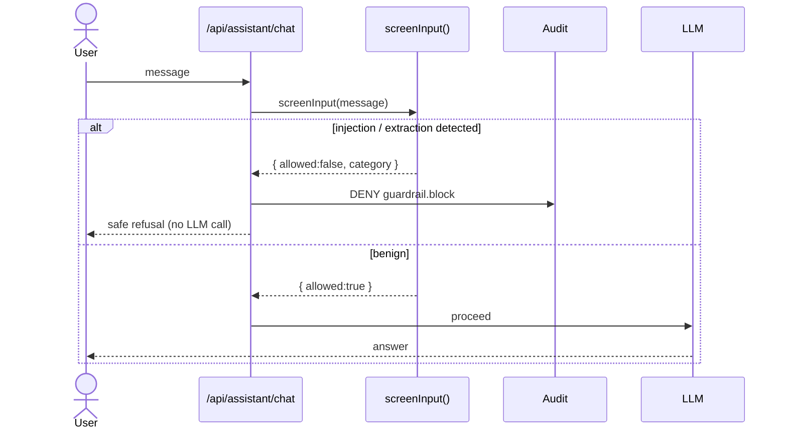
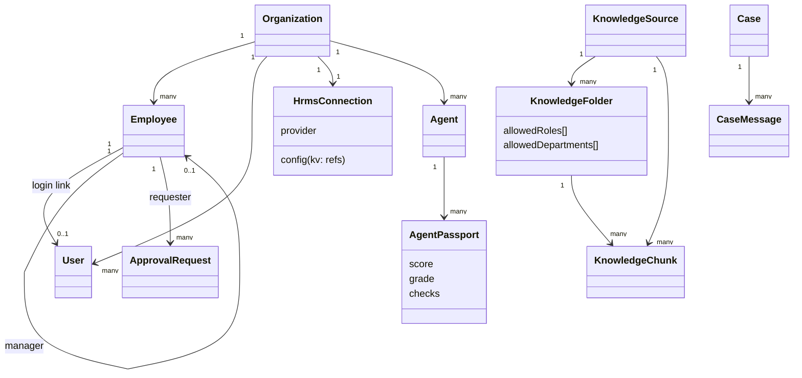

# Key Flows — Sequence Diagrams

Sequence diagrams for the platform's core flows. Rendered with Mermaid.

---

## 1. HRMS Sync (Frappe HR → platform)



---

## 2. Action with confirmation + Passport gate (apply leave)



---

## 3. Runtime guardrail screen



---

## 4. Leave write-back round-trip

```mermaid
sequenceDiagram
    actor Emp as Employee
    participant App as applyLeave()
    participant DB as Postgres
    participant F as Frappe HR
    actor Mgr as Manager

    Emp->>App: confirm leave
    App->>DB: load requester + manager
    App->>F: POST Leave Application (Open)
    F-->>App: HR-LAP-xxxx
    App->>DB: ApprovalRequest { externalRef: HR-LAP-xxxx }
    App->>Mgr: notification (approval needed)
    Mgr->>DB: approve → leave.approved
    Note over Emp,F: Employee sees status in /my-requests;<br/>leave visible in Frappe HR
```

---

## 5. Class / data model (core entities)


