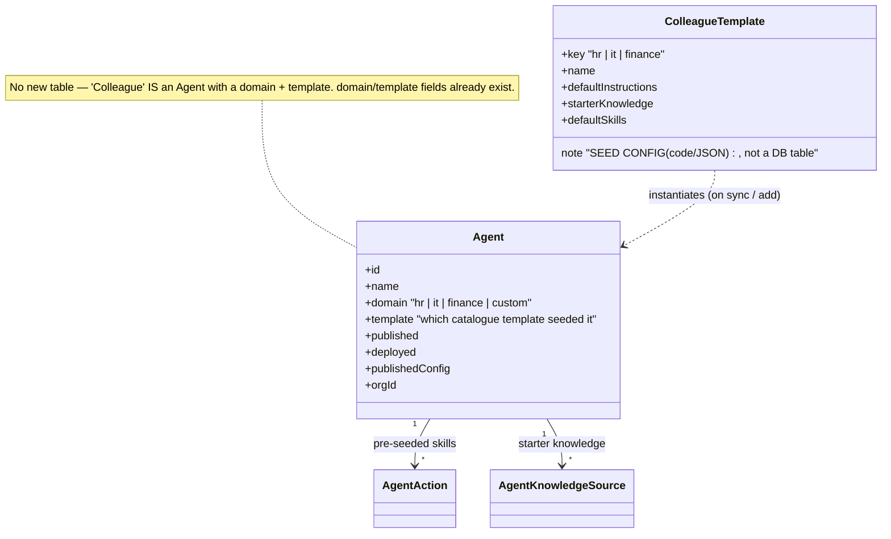
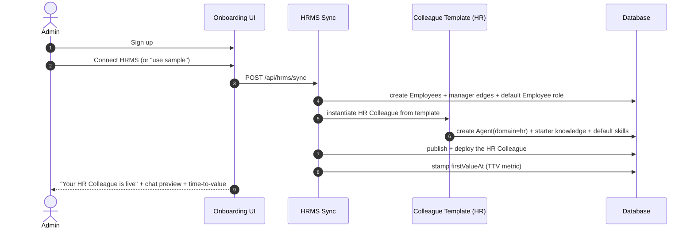

# Feature: Colleagues Reframe (pre-built colleagues + catalogue front door)

> SCRUM artifacts for the reframe agreed in §R: **Agent Studio stops being the front door;
> pre-built HR/IT/Finance Colleagues become the entry point, auto-deployed on HRMS sync;
> the builder becomes the "Customize" layer behind a working colleague.**
> Order follows our standard: **User Stories → Use Cases → UML (class + sequence) → Screens → (gate) → build.**
> Status: 🟡 PENDING SIGN-OFF. No code until signed off.

---

## 1. User Stories

### Onboarding / time-to-value (NEW — the P0 wedge)
| ID | As a… I want… | so that… | MVP |
|---|---|---|---|
| ONB-1 | Admin — when I connect my HRMS, a working **HR Colleague auto-deployed** | I get value in minutes without building anything | ✅ P0 |
| ONB-2 | Admin — to see **"time to first value"** (synced → live → first answer) | I trust it's working and can show ROI | ✅ P0 |
| ONB-3 | Admin — a **"use sample data"** option if I'm not ready to connect HRMS | I can try it instantly | 🟡 |

### Colleague catalogue (reframe of Agent Studio)
| ID | As a… I want… | so that… | MVP |
|---|---|---|---|
| CAT-1 | Admin — a **catalogue of pre-built colleagues** (HR, IT, Finance) | I add a whole domain in one click | ✅ |
| CAT-2 | Admin — each colleague **pre-seeded with skills + starter knowledge** | it works on day one, not blank | ✅ |
| CAT-3 | Admin — to **Customize** a colleague (instructions, knowledge, skills, guardrails) | I can fit it to my company | ✅ (existing builder, demoted) |
| CAT-4 | Admin — a **"Start from scratch"** custom colleague option | advanced/edge cases still possible | 🟡 |
| CAT-5 | Admin — see each colleague's **status** (Draft / Live / Deployed) + quick actions (Open, Customize, Chat) | I manage them at a glance | ✅ |

### Routing (later — P2)
| ID | As a… I want… | so that… | MVP |
|---|---|---|---|
| ROUTE-1 | Employee — **one assistant** that routes my HR/IT/Finance question to the right colleague | I don't pick which bot | ⛔ later (lite router) |

> Reuses existing stories EMP-*, MGR-*, DA-*, WA-* unchanged; this feature only changes the
> **entry point + onboarding**, not the underlying capabilities.

---

## 2. Use Cases

- **UC-A Admin onboarding (golden path):** signup → Connect HRMS (or sample) → auto-sync provisions org/roles/knowledge-access → **HR Colleague auto-instantiated from template + deployed** → admin sees "live" + can chat. *(ONB-1,2,3)*
- **UC-B Add a colleague from catalogue:** admin opens Colleagues → "Add" → picks IT/Finance → instantiated from template (pre-seeded skills/knowledge) → optionally customize → deploy. *(CAT-1,2)*
- **UC-C Customize a colleague:** admin opens a colleague → "Customize" → existing builder screens (instructions/knowledge/skills/guardrails/publish). *(CAT-3)*
- **UC-D Employee uses colleague:** unchanged — `/assistant`, confirm-gated skills, JIT permissions. *(EMP-*)*

---

## 3. UML

### 3.1 Class deltas (mostly framing — minimal schema change)

### 3.2 Sequence — golden path (UC-A)

---

## 4. Screen Inventory & Map (deltas)

| Screen | Was | Becomes |
|---|---|---|
| Sidebar nav | "Agents Studio" (front door) | **"Colleagues"** (front door) |
| Colleagues home | "AI Agents" list + "Create new AI agent" | **Colleague cards** (HR Live/Deployed, IT/Finance "Add") + status + Open/Customize/Chat |
| Add flow | blank "create agent" | **Catalogue**: HR · IT · Finance · "Start from scratch" |
| Customize | the builder (was the default) | same screens, now reached via **"Customize"** on a colleague |
| Onboarding | (none) | **NEW**: Connect HRMS → "Your HR Colleague is live" moment + TTV |

UX mock (static, non-functional): `docs/diagrams/ux-colleagues-mock.html`.

---

## 5. Gate
Sign off Sections 1–4 (and the UX mock) → then build **P0**: seed HR template, auto-deploy on sync,
stamp `firstValueAt`, flip the front door to Colleagues. Engine (Agent/knowledge/skills/RBAC) unchanged.
